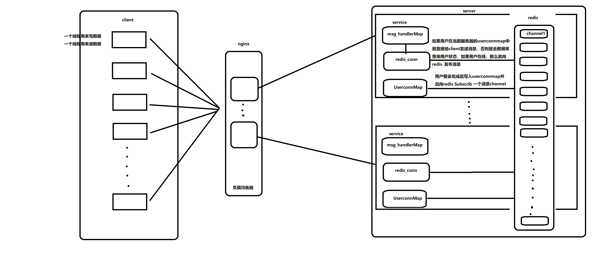

# ChatServer

## 服务端模块  ---  数据库

MySQL类进行对MySQL类对象操作,使用RAII方法管理资源，退出当前作用域自动析构
mysql的操作都是通过query函数进行操作的

``` hpp
class MySQL
{
public:
    // 初始化一个数据库连接
    MySQL();    //mysql_init
    // 释放数据库连接资源
    ~MySQL();   //mysql_close
    // 连接数据库并且设置编码格式 mysql_query(_conn,"set names gbk");
    bool connect(); //mysql_real_connect
    // 更新操作
    bool update(string sql);
    // 查询操作
    MYSQL_RES *query(string sql);
    // 获取连接
    MYSQL* getConnection();
private:
    MYSQL *_conn; //相当于一个连接句柄，通过它来进行一系列的操作
};
```

* 对应的数据库中存在的表中的数据 

### Tables

| 表中的数据 \ 表名 | User | Friend | AllGroup | GroupUser | offlineMessage |
| ---------------  | ---- | ------ | -------- | --------- | -------------- |
| primary key     | id  INT auto_increment | userid friendid 联合主键| 组id INT auto_increment | groupid | userid |
| another  parameter |  name(varchar(50)) password (varchar(16)) state enum('offline','online')| |groupname(varchar(20) groupdesc(200)) | userid, grouprole enum('creator','normal')| message varchar(500) |

### 对应的数据类以及操作对应数据的方法
``` cpp
class User
{
public:
    User(int id = -1, string name = "", string pwd = "", string state = "offline")
    {
        this->id = id;
        this->name = name;
        this->password = pwd;
        this->state = state;
    }

    void setId(int id) { this->id = id; }
    void setName(string name) { this->name = name; }
    void setPwd(string pwd) { this->password = pwd; }
    void setState(string state) { this->state = state; }

    int getId() { return this->id; }
    string getName() { return this->name; }
    string getPwd() { return this->password; }
    string getState() { return this->state; }

private:
    int id;
    string name;
    string password;
    string state;
};
-----------------------------------------------------------------------
class Group
{
public:
    Group(int id = -1, std::string name = "", std::string desc = "")
    {
        this->id = id;
        this->name = name;
        this->desc = desc;
    }
    void setId(int id){this->id = id;}
    void setName(std::string name){this->name = name;}
    void setDesc(std::string desc){this->desc = desc;}

    int getId(){return this->id;}
    std::string getName(){return this->name;}
    std::string getDesc(){return this->desc;}
    std::vector<groupuser>& getUsers(){return this->users;}

private:
    int id;
    std::string name;
    std::string desc;
    std::vector<groupuser> users;
};
-----------------------------------------------------------------------

class groupuser : public User
{
    public:
        void setRole(string role){
            this->role = role;
        }
        string getRole(){
            return this->role;
        }

    private:
        string role;

};
```

### 对应的model类
```cpp
class friendmodel
{
    public:
        //添加好友关系
        void insert(int userid, int friendid);

        //删除好友关系


        //返回用户好友列表
        std::vector<User> query(int userid);
};
-------------------------------------------------

class GroupModel{
    public:
        //create group
        bool creategroup(Group &group);

        //join group
        void addGroup(int userid,int groupid, string role);

        //查询用户所在群组信息
        vector<Group> queryGroups(int userid);

        //根据指定的groupid查询群组用户id列表，除userid自己，主要用户群聊业务给群组其它成员群发消息
        vector<int> queryGroupUsers(int userid,int groupid);
};
-------------------------------------------------
class OfflineMsgModel
{
public:
    // 存储用户的离线消息
    void insert(int userid, string msg);

    // 删除用户的离线消息
    void remove(int userid);

    // 查询用户的离线消息
    vector<string> query(int userid);
};
-------------------------------------------------
class UserModel
{
public:
    // User表增加方法
    bool insert(User &user);
    // 根据用户号码查询用户信息
    User query(int id);

    // 更新用户的状态信息
    bool updateState(User user);

    // 重置用户的状态信息
    void resetState();
};
```

## 服务端模块  ---  服务模块

* 与客户端通信协议一致性： 定义消息类型

```cpp
enum EnMsgType{
    LOGIN_MSG = 1,  //登录消息
    LOGIN_MSG_ACK,  //登录响应信息
    LOGINOUT_MSG,     //注销信息

    REG_MSG ,        //register msg
    REG_MSG_ACK,    //注册响应消息
    
    ONE_CHAT_MSG,   //聊天消息

    ADD_FRIEND_MSG, //添加好友消息
    
    CREATE_GROUP_MSG,   //创建群组
    ADD_GROUP_MSG,      //加入群组
    GROUP_CHAT_MSG      //群聊天
};

```


* ChatServer

```cpp
/*
1. 组合TCPserver对象
2. 创建EventLoop事件循环对象指针
3. 明确Tcpserver构造函数需要什么参数，输出ChatServer的构造函数
4. 在当前服务器类的构造函数中注册处理连接和读写的回调
*/
class ChatServer{
    public:
        //初始化聊天服务器对象，注册用户连接和读写回调，设置IO线程数目
        ChatServer(EventLoop *loop, const InetAddress &listenAddr,const string &nameArg);      //事件循环//Ip+port//服务器名字 
       
        //启动服务
        void start();

    private:
        //上报连接事件相关函数
        void onConnection(const TcpConnectionPtr &conn);
        //上报读写事件相关函数
        void onMessage(const TcpConnectionPtr& conn,Buffer *buffer,Timestamp time);
        TcpServer _server;  //组合muduo库
        EventLoop *_loop;   //event事件循环对象的指针

};
```

* ChatService 单例模式

``` cpp

// 表示处理消息的回调方法
using MsgHandler = std::function<void(const TcpConnectionPtr &conn, json &js, Timestamp)>;

class ChatService
{
public:
    // 获取单例对象的结构函数
    static ChatService *getinstance();
    
    // 获取消息对应的处理器
    MsgHandler getHandler(int msgid);

     // 从redis消息队列中获取订阅的消息
    void handleRedisSubscribeMessage(int, string);

//--------------------------------------------------下面都是业务，写对应的业务逻辑即可，业务的参数都是一样的，把他们都放在一个unorder_map中

    // 处理登录业务
    void login(const TcpConnectionPtr &conn, json &js, Timestamp tm);

    // 处理注册业务
    void reg(const TcpConnectionPtr &conn, json &js, Timestamp tm);

    // 处理客户端异常退出
    void clientCloseExcetion(const TcpConnectionPtr &conn);

    // 1v1聊天
    void oneChat(const TcpConnectionPtr &conn, json &js, Timestamp time);

    // 添加好友业务
    void addFriend(const TcpConnectionPtr &conn, json &js, Timestamp time);

    // 服务器夜场，业务重置方法
    void reset();

    // 创建群组
    void createGroup(const TcpConnectionPtr &conn, json &js, Timestamp time);

    // 加入群组
    void addGroup(const TcpConnectionPtr &conn, json &js, Timestamp time);

    //群组聊天
    void groupChat(const TcpConnectionPtr &conn, json &js, Timestamp time);

    //退出登录
    void loginout(const TcpConnectionPtr &conn, json &js, Timestamp time);

   

private:
    //注册msgid以及对应的Handler回调操作
    ChatService();
    
    //发布订阅功能对象
    Redis _redis;

    //存放对应message type和对应的回调函数
    unordered_map<int, MsgHandler> _msgHandlerMap;
   
    // 存储在线用户的连接信息
    unordered_map<int, TcpConnectionPtr> _userConnMap;

    // 定义互斥锁 保证_userConnMap的线程安全，因为它是会有多个用户来进行记录自己的conn
    mutex _connMutex;

    // 数据操作类对象
    UserModel _userModel;

    // 离线消息
    OfflineMsgModel _offlinemsgmodel;

    // 操作friend表的对象
    friendmodel _friendModel;

    //操作群的对象
    GroupModel _groupmodel;
 
};

```

## 服务端模块  ---  集群模块

* 使用了redis的发布-订阅功能，使用的是hiredis
 
```cpp
class Redis
{
public:
    Redis();
    ~Redis();

    // 向redis指定的通道channel发布消息 负责publish发布消息的上下文连接 负责subscribe订阅消息的上下文连接初始化 redisConnect，并且开辟一个新的detach线程监听通道上的消息，并给业务层进行上报
    bool connect();

    // 在独立线程中接收订阅通道中的消息
    void observer_channel_message();

    //
    bool publish(int channel, std::string massage);

    // 向redis指定的通道subcribe订阅消息
    bool subscribe(int channel);

    // 向redis指定的通道unsubscribe取消订阅消息
    bool unsubscribe(int channel);

    

    // 初始化向业务层上报通道消息的回调对象
    void init_notify_handler(std::function<void(int, std::string)> fn);

private:
    // hiredis同步上下文对象，负责publish消息
    redisContext *_publish_context;

    // hiredis同步上下文对象，负责subscribe消息
    redisContext *_subcribe_context;

    // 回调操作，收到订阅的消息，给service层上报
    std::function<void(int, std::string)> _notify_message_handler;
};
```




